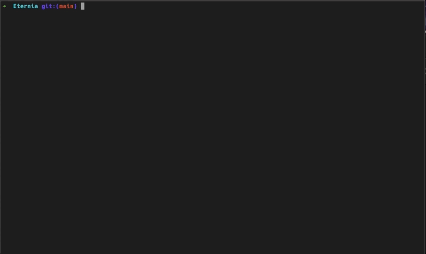

# ctrlr

> Turn your shell history into a searchable command palette  
> Stop googling commands you already used.



---

## Features

- **Instant search** through your shell history
- **Favorites** for frequently used commands
- **Tags & collections** to organize commands
- **Fast TUI** powered by `ratatui`
- **Keyboard-first workflow**
- Works with bash, zsh, fish

---

## Usage

### Open the command picker

```bash
ctrlr
```

Search, select, execute.

### Enable Ctrl+R integration

```bash
ctrlr init
```

Replaces your default reverse search with ctrlr.

---

## Why ctrlr?

Default shell history search is:
- Linear and hard to navigate
- Limited search capabilities
- Impossible to organize

ctrlr gives you:
- Fuzzy search
- Favorites & tagging
- Structure over time

### Motivation

I kept forgetting useful commands and re-googling them.

ctrlr turns your shell history into a personal command palette.

---

## Installation

### Quick Install (curl)

```bash
curl -fsSL https://github.com/capydev42/ctrlr/releases/latest/download/install.sh | bash
```

For a specific version:
```bash
curl -fsSL https://github.com/capydev42/ctrlr/releases/download/v0.1.0/install.sh | bash
```

To install to a custom location:
```bash
curl -fsSL https://github.com/capydev42/ctrlr/releases/latest/download/install.sh | bash -s -- --dir /usr/local/bin
```

### From Release (manual)

1. Download from: https://github.com/capydev42/ctrlr/releases
2. Extract the archive for your platform
3. Move the binary to a location in your PATH

```bash
tar -xzf ctrlr-x86_64-unknown-linux-gnu.tar.gz
mv ctrlr ~/.local/bin/   # or /usr/local/bin/
```

### From Source

```bash
git clone https://github.com/capydev42/ctrlr.git
cd ctrlr
cargo build --release
mv target/release/ctrlr ~/.local/bin/
```

---

## Keybindings

### Global

| Key   | Action                      |
|-------|----------------------------|
| Tab   | Switch pane                 |
| Enter | Select command / Focus list |
| Esc   | Exit / cancel               |
| 1     | Show History                |
| 2     | Show Favorites              |
| 3     | Show Collections            |
| c     | Add to collection           |

### Navigation (History / Favorites)

| Key          | Action           |
|--------------|------------------|
| j / k        | Navigate (vim)   |
| Up / Down    | Navigate         |
| /            | Jump to search   |
| Enter        | Execute command  |

### Search

| Key       | Action           |
|-----------|------------------|
| Type      | Search           |
| Backspace | Delete character |
| Enter     | Focus list       |
| Esc       | Clear / exit     |

### Tag Editor

| Key       | Action              |
|-----------|---------------------|
| Type      | Add tags            |
| Up / Down | Navigate suggestions|
| Enter     | Select / Create     |
| Tab       | Autocomplete        |
| Esc       | Cancel              |

### Collections View

| Key   | Action                        |
|-------|-------------------------------|
| n     | Create new collection         |
| e     | Edit / rename collection      |
| d     | Delete collection             |
| r     | Remove command from collection |

---

## Storage

Data is stored locally using SQLite:

- Command metadata (favorites, usage)
- Tags
- Collections

**Locations:**

- Linux: `~/.local/share/ctrlr/ctrlr.db`
- macOS: `~/Library/Application Support/ctrlr/ctrlr.db`

---

## Roadmap

- [x] Fuzzy search
- [x] Favorites & tags
- [x] Collections
- [ ] Better ranking (recency + frequency)
- [ ] Improved collections UX
- [ ] Copy commands to clipboard
- [ ] Import / export collections
- [ ] Command preview / metadata
- [ ] Vim-style navigation improvements
- [ ] Plugin / extensibility ideas

---

## Contributing

Ideas, feedback, and UX suggestions are very welcome.

---

## Built with ❤️

- [ratatui](https://ratatui.rs/) – TUI framework
- [crossterm](https://github.com/crossterm-rs/crossterm) – terminal I/O
- [fuzzy-matcher](https://github.com/lotabout/fuzzy-matcher) – fuzzy search
