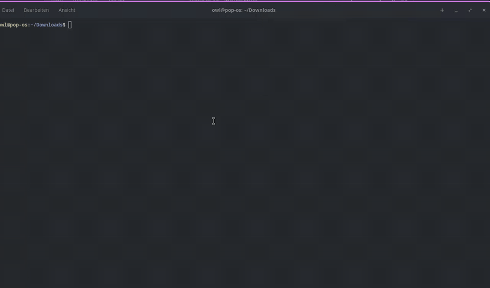

# ctrlr

[](https://github.com/capydev42/ctrlr/actions)
[](https://github.com/capydev42/ctrlr/releases)
[](LICENSE.md)


> Turn your shell history into a searchable command palette  
> Stop googling commands you already used.



---

## Install

```bash
curl -fsSL https://github.com/capydev42/ctrlr/releases/latest/download/install.sh -o install.sh && chmod +x install.sh && ./install.sh
```

The script asks where to install and downloads the binary for your platform.

<details>
<summary>Other ways to install</summary>

**A specific version:**
```bash
curl -fsSL https://github.com/capydev42/ctrlr/releases/download/v0.8.0/install.sh -o install.sh && chmod +x install.sh && ./install.sh
```

**A fixed directory, no prompt:**
```bash
INSTALL_DIR=/usr/local/bin ./install.sh
```

**From a release archive:** download from the
[releases page](https://github.com/capydev42/ctrlr/releases), then
```bash
tar -xzf ctrlr-x86_64-unknown-linux-gnu.tar.gz
mv ctrlr ~/.local/bin/   # or /usr/local/bin/
```

**From source** (needs Rust 1.88 or newer):
```bash
git clone https://github.com/capydev42/ctrlr.git
cd ctrlr
cargo build --release
mv target/release/ctrlr ~/.local/bin/
```
</details>

---

## Quick start

Open the command palette:

```bash
ctrlr
```

Type to search, `Enter` to put the command on your prompt line. `?` shows every
shortcut.

Then bind it to `Ctrl+R`, replacing your shell's own reverse search:

```bash
ctrlr init
```

Restart your shell and `Ctrl+R` opens ctrlr. The same integration is what lets
ctrlr know **where** your commands ran — see [How it works](#how-it-works).
ctrlr also offers to install it for you the first time you run it, and backs your
config up to `<config>.ctrlr.bak` before touching it.

Works with **bash**, **zsh** and **fish**, on Linux and macOS.

---

## Features

**Search that knows what you meant**
- Fuzzy search over your whole history — `gp o` finds `git push origin main`
- Tags are searched too, so a command you tagged `deploy` shows up under `deploy`
- Results are ranked, not just filtered: favorites first, then commands you have
  run *in this directory*, then recent ones, then frequent ones

**Directory-aware history**
- ctrlr records which directory each command ran in, and how it exited
- `.` scopes the list to the current directory — the rest of your history steps
  aside while you work in a repo
- The details pane shows how often a command ran, how often it ran *here*, its
  last exit code, and the directories it runs in most

**Organize what you keep**
- `f` favorites a command, `t` tags it, `c` puts it in a collection
- Collections are named groups you create, rename and delete from the TUI (`3`)
- Commands added to a collection stick around even after they age out of your
  shell history

**Made to live in**
- 4 Catppuccin flavors (Latte, Frappé, Macchiato, Mocha) with a live-preview
  picker on `Ctrl+T`, remembered across launches
- Panes resize with `<` / `>` or by dragging their border, and the width is
  remembered; `d` hides the details pane entirely
- Full mouse support — click, double-click to run, right-click for a context
  menu, wheel to scroll
- Keyboard-first everywhere; vim keys where you expect them

**Yours to keep**
- Everything is local SQLite — no account, no network, no telemetry
- Import and export as JSON from the CLI or from the TUI (`Ctrl+E` / `Ctrl+O`),
  with a preview before anything is written

---

## How it works

ctrlr never executes anything itself. It reads your shell's history file, shows
you a picker, and hands the command you chose back to the shell, which puts it on
your prompt line. Nothing runs until you press Enter yourself. That holds for
edited commands too. `Ctrl+x` opens the selected command in `$VISUAL` /
`$EDITOR` and puts whatever you save on the prompt line. `e` instead opens a
one-line editor inside ctrlr, and `Ctrl+x` from there is the same detour through
`$EDITOR`, coming back to the line so you can look before you commit. Either
way, nothing runs on its own.

An edited command is not written to ctrlr's database. The original keeps its
favorites, tags and run count, because the original is not what ran. Your
edited version shows up in the list on the next launch, the same way every
other command does — once your shell has actually run it.

Metadata — favorites, tags, collections, run counts — lives in a local SQLite
database. Your history file stays the source of truth for the command text.

**Where commands ran.** No shell writes the working directory into its history
file, so it cannot be recovered after the fact. The integration installed by
`ctrlr init` appends one line per command to `~/.local/share/ctrlr/runs.log`
using a shell builtin — no process is spawned per prompt — and ctrlr drains that
log on launch. This only covers commands run *after* the integration is
installed; existing history has no directories attached to it.

On zsh and fish the directory recorded is the one the command was typed in. On
bash the same holds when [bash-preexec](https://github.com/rcaloras/bash-preexec)
is loaded — starship and atuin both bring it. Without it, ctrlr falls back to
logging at prompt time, so a `cd` is recorded against the directory it moved to.

If ctrlr tells you the installed integration is outdated, re-run `ctrlr init`:
the old block still binds `Ctrl+R`, but features it has no hooks for stay
silently empty.

---

## Keybindings

Press `?` (or `F1`) inside ctrlr for a searchable version of this table.

### Navigation

| Key                | Action                        |
|--------------------|-------------------------------|
| `j` / `↓`          | Move down                     |
| `k` / `↑`          | Move up                       |
| `Ctrl+d` / `PageDown` | Page down (~half a screen) |
| `Ctrl+u` / `PageUp`   | Page up (~half a screen)   |
| `gg`               | Jump to the top               |
| `G`                | Jump to the bottom            |

### Actions

| Key       | Action                                       |
|-----------|----------------------------------------------|
| `Enter`   | Put the selected command on the prompt line  |
| `e`       | Edit the command before running it           |
| `Ctrl+x`  | Open the command in `$VISUAL` / `$EDITOR` and run what you save |
| `f`       | Toggle favorite                              |
| `y`       | Copy to clipboard                            |
| `t`       | Edit tags                                    |
| `c`       | Add to a collection                          |
| `d`       | Show / hide the details pane                 |
| `/`       | Focus the search bar                         |
| `Ctrl+u`  | Clear the search (when the search bar has focus) |
| `Ctrl+t`  | Theme picker                                 |
| `Ctrl+e`  | Export popup                                 |
| `Ctrl+o`  | Import popup                                 |
| `?` / `F1`| Help                                         |
| `Esc` / `Ctrl+C` | Clear / close / exit                  |

### Rebinding

Every key above can be changed. Start from the defaults:

```bash
mkdir -p ~/.config/ctrlr
ctrlr config --print > ~/.config/ctrlr/config.toml
```

```toml
[keys.history]
toggle_favorite = "v"
edit_command = ["e", "ctrl+x"]

[keys.global]
go_to_top = "g g"      # a space makes a two-key sequence
```

Listing an action **replaces** its default keys, so you can drop one you dislike.
Anything you leave out keeps its default. Contexts are `global`, `search`,
`history`, `collections_list`, `collection_items`, `help`, `tag_input`,
`collection_input`, `import_export`, `theme_popup`, `context_menu`,
`integration_popup` and `edit_command`; `ctrlr config --print` lists them all
with every action name.

Modifiers are `ctrl`, `alt` and `shift`. Named keys are `enter`, `esc`, `tab`,
`space`, `backspace`, `delete`, `insert`, `home`, `end`, `pageup`, `pagedown`,
`up`, `down`, `left`, `right` and `f1`–`f12`. Anything else one character long
is that character, and case matters — `g` and `G` are different keys.

One thing to know: **a plain character always types when the search bar has
focus.** That is why `d` and `?` do nothing special there, and why a letter you
bind only fires from the other panes. Use a modifier if you want it everywhere.

A key that another action already owns in the same context is taken from it. A
line ctrlr cannot read — a bad key name, an action that does not exist, broken
TOML — keeps its default and is listed under **Config** at the top of the help
popup. ctrlr always starts.

### Views

| Key                       | Action                                    |
|---------------------------|-------------------------------------------|
| `1` / `2` / `3`           | History / Favorites / Collections         |
| `.`                       | Scope the list to the current directory   |
| `Alt+1` `Alt+2` `Alt+3` `Alt+.` | The same, from any pane            |

### Panes

| Key                   | Action                                              |
|-----------------------|-----------------------------------------------------|
| `Tab`                 | Cycle panes                                         |
| `Ctrl+h/j/k/l`        | Focus the pane left / below / above / right         |
| `<` / `>`             | Narrow / widen the details pane, or the collections pane when it has focus |
| `Alt+<` / `Alt+>`     | The same, from any pane                             |

### Collections view

| Key | Action                          |
|-----|---------------------------------|
| `n` | New collection                  |
| `e` | Rename collection               |
| `d` | Delete collection               |
| `a` | Search commands to add          |
| `r` | Remove command from collection  |

> `1`, `2`, `3`, `.`, `<`, `>` and `?` type into the search bar when it has
> focus — that is what the `Alt+` variants are for.

### Mouse

| Input                      | Action                                                     |
|----------------------------|------------------------------------------------------------|
| Click                      | Select a row, switch tab, focus the search bar             |
| Double-click               | Run the command                                            |
| Right-click a command      | Context menu: Run, Copy, Favorite, Tag, Add to / Remove from collection |
| Right-click the collections pane | Open, Rename, Delete, New collection                 |
| Drag a pane border         | Resize it; drag past the minimum to hide the details pane  |
| Wheel                      | Scroll the list under the pointer                          |
| Click outside a popup      | Close it                                                   |
| `Shift` + drag             | Your terminal's own text selection                         |

Both context menus are keyboard-driven too (`j` / `k`, `Enter`, `Esc`). ctrlr
holds the mouse for as long as it runs, which is why selecting text needs
`Shift` held.

---

## Import & export

From inside the TUI: `Ctrl+E` opens the export popup, `Ctrl+O` the import popup —
type a path, and import shows you a preview (new commands, new collections,
duplicates) before writing anything.

From the CLI:

```bash
ctrlr export                        # print JSON to stdout
ctrlr export backup.json            # write to a file

ctrlr import backup.json            # merge (default)
ctrlr import backup.json --dry-run  # preview, change nothing
ctrlr import backup.json --replace  # wipe everything first (asks y/N)
```

- **Merge** adds new commands, skips duplicates, and merges tags and collections
- **Replace** deletes all existing data before importing
- **Dry run** prints what would happen and exits

The format is versioned JSON, so an export from an older ctrlr still imports.

---

## Storage

Local SQLite. Command metadata (favorites, use counts), tags, collections, run
records and your theme.

- Linux: `~/.local/share/ctrlr/ctrlr.db`
- macOS: `~/Library/Application Support/ctrlr/ctrlr.db`

The run log lives next to it as `runs.log`. If the database cannot be opened,
ctrlr still runs — read-only, straight off your shell history.

---

## Why ctrlr?

Default shell history search is linear, hard to navigate, and impossible to
organize. You either remember the command or you go and google it again.

ctrlr gives you fuzzy search over everything you have ever run, ranked by what
you actually use and where you are standing, plus somewhere to put the commands
worth keeping.

I wasted a lot of time re-googling commands I had already used.

---

## Roadmap

- [x] Fuzzy search
- [x] Favorites & tags
- [x] Collections
- [x] Import/export (CLI)
- [x] Import/export (TUI)
- [x] Better ranking (recency + frequency)
- [x] Directory-aware history
- [x] Mouse support & resizable panes
- [ ] Improved collections UX
- [ ] Richer command preview
- [ ] Vim-style navigation improvements
- [ ] Plugin / extensibility ideas

---

## Contributing

Ideas, feedback, and UX suggestions are very welcome.

---

## Built with ❤️

- [ratatui](https://ratatui.rs/) – TUI framework
- [crossterm](https://github.com/crossterm-rs/crossterm) – terminal I/O
- [fuzzy-matcher](https://github.com/lotabout/fuzzy-matcher) – fuzzy search
- [rusqlite](https://github.com/rusqlite/rusqlite) – SQLite storage
- [arboard](https://github.com/1Password/arboard) – clipboard access

Colors from [Catppuccin](https://catppuccin.com/).
